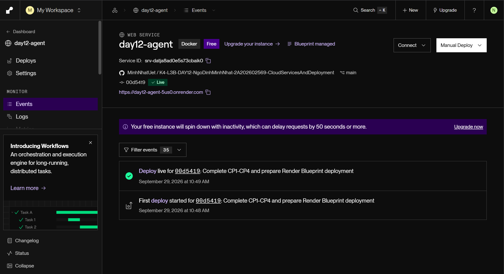
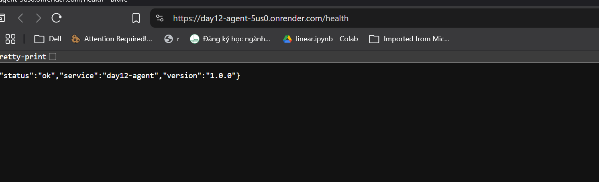

# Thông tin deploy — Checkpoint 5

## Thông tin học viên

| Mục | Nội dung |
|-----|----------|
| Họ và tên | Ngô Đình Minh Nhật |
| Mã học viên | 2A202602569 |
| Repository | https://github.com/MinhNhatUet/K4-L3B-DAY12-NgoDinhMinhNhat-2A202602569-CloudServicesAndDeployment |

## Service

| Mục | Nội dung |
|-----|----------|
| Public URL | https://day12-agent-5us0.onrender.com |
| Platform | Render |
| Ngày xác minh | 2026-09-29 |
| Deploy được chụp | Commit `00d5419`, trạng thái Live, 2026-09-29 lúc 10:49 theo dashboard |
| Triển khai | Dockerfile và Blueprint render.yaml; Render Key Value |
| Local fallback | Không sử dụng |

## Biến môi trường

Không ghi giá trị secret. Nguồn cấu hình theo Blueprint; không truy cập dashboard để kiểm tra từng giá trị.

| Biến | Nguồn và bằng chứng |
|------|--------------------|
| `PORT` | Render tự cấp; Blueprint không ghi đè; public endpoint hoạt động |
| `AGENT_API_KEY` | Secret nhập trên Render; app khởi động và từ chối request không có key; chưa kiểm tra request có key |
| `REDIS_URL` | connectionString từ Render Key Value; `/ready` xác nhận kết nối Redis thành công |
| `RATE_LIMIT_PER_MINUTE` | Blueprint cấu hình 10 |
| `MONTHLY_BUDGET_USD` | Blueprint cấu hình 10.0 |
| `LOG_LEVEL` | Blueprint cấu hình INFO |

## Lệnh kiểm tra (PowerShell)

```powershell
$URL = "https://day12-agent-5us0.onrender.com"
curl.exe -i "$URL/health"
curl.exe -i "$URL/ready"
'{"question":"Hello"}' | curl.exe -i "$URL/ask" -H "Content-Type: application/json" --data-binary "@-"
python -m pytest tests/test_cp5.py -v
```

## Kết quả gọi URL thật

Xác minh trực tiếp bằng HTTP client ngày 2026-09-29, độc lập với output curl học viên cung cấp. Dưới đây là status và body thực tế (không phải toàn bộ HTTP headers):

```text
GET https://day12-agent-5us0.onrender.com/health
HTTP 200
{"status":"ok","service":"day12-agent","version":"1.0.0"}

GET https://day12-agent-5us0.onrender.com/ready
HTTP 200
{"status":"ready","redis":true}

POST https://day12-agent-5us0.onrender.com/ask
HTTP 401
{"detail":"invalid or missing API key"}
```

Kiểm tra `/ask` có xác thực và rate limit trên cloud chưa được xác minh trong lần kiểm tra này. Có thể đặt `DEPLOY_API_KEY` trong `.env` cục bộ (đã được Git ignore) để chạy test bổ sung; không dùng token Render thay API key của service.

## Ảnh chụp màn hình

Kết quả checkpoint ngày 2026-09-29: **8 passed, 5 skipped**. Bốn test fallback được bỏ qua vì dùng cloud; một test có xác thực được bỏ qua vì chưa đặt `DEPLOY_API_KEY`. Không có test thất bại.

Đã kiểm tra trực quan cả hai ảnh: đúng service và URL, không thấy giá trị API key, token hoặc mật khẩu Redis.

- [Dashboard Render](screenshots/dashboard.png): service `day12-agent`, URL public, commit `00d5419` và trạng thái Live.
- [Health endpoint](screenshots/health.png): thanh địa chỉ HTTPS `/health` và JSON có `status: ok`, service `day12-agent`, version `1.0.0`. Mép trái ảnh cắt nhẹ dấu mở JSON nhưng nội dung xác nhận vẫn đọc rõ.




